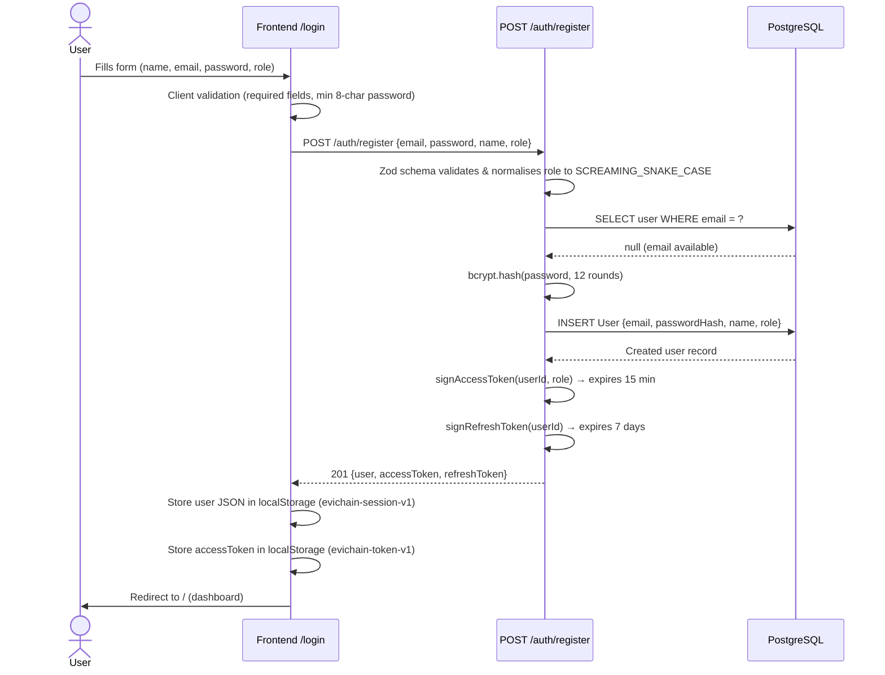
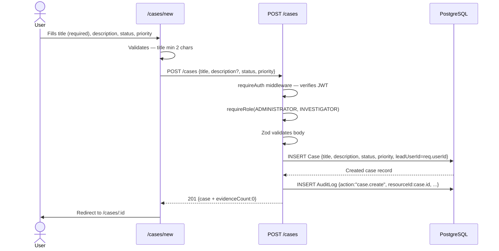
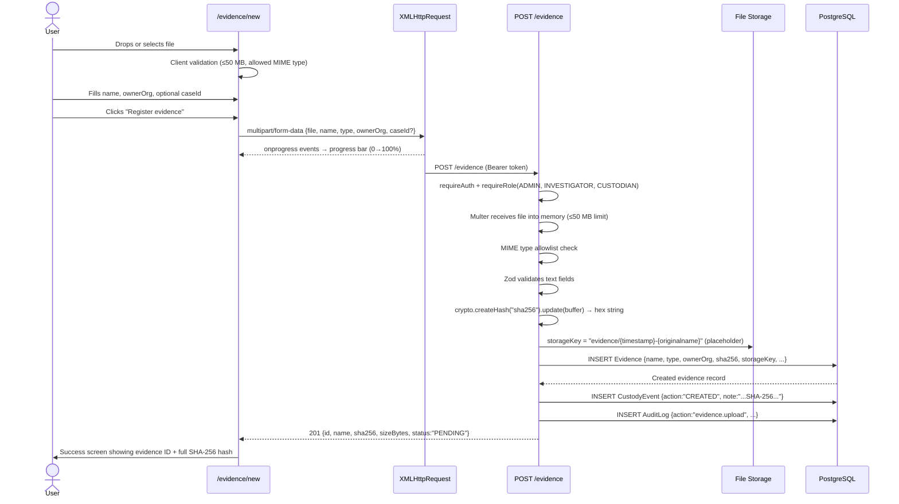
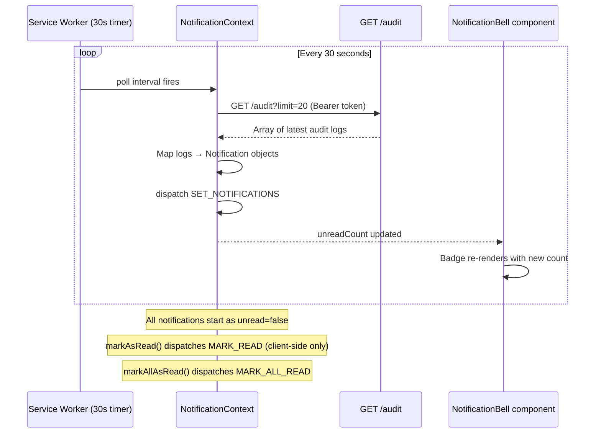
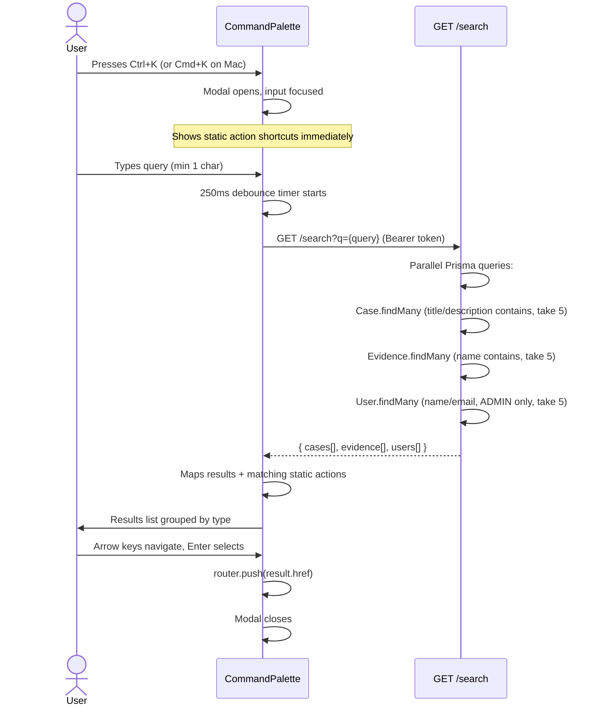

# EviChain — Complete Workflow Documentation

> **Purpose:** This document explains every end-to-end user journey across frontend, backend, database, and external systems. It is written for developers, auditors, and stakeholders who need to understand *what happens* when a user performs an action — without reading source code.

---

## Table of Contents

1. [System Overview](#1-system-overview)
2. [User Registration & Authentication](#2-user-registration--authentication-flow)
3. [Case Management](#3-case-management-workflow)
4. [Evidence Management](#4-evidence-management-workflow)
5. [Chain of Custody](#5-chain-of-custody-workflow)
6. [Audit & Reporting](#6-audit--reporting-workflow)
7. [Notification System](#7-notification-system-workflow)
8. [Admin & User Management](#8-admin--user-management-workflow)
9. [Search & Navigation](#9-search--navigation-workflow)
10. [Mobile PWA](#10-mobile-pwa-workflow)
11. [Error Handling & Edge Cases](#11-error-handling--edge-cases)
12. [Security & Compliance](#12-security--compliance)
13. [Future Enhancements](#13-future-enhancements)

---

## 1. System Overview

EviChain is a forensic-grade Chain of Custody platform for digital evidence. It allows investigative teams to register digital files (videos, images, documents, disk images), compute a tamper-proof SHA-256 fingerprint for each file server-side, track every access and transfer in an immutable custody ledger, and export court-ready audit reports. Every action is logged, every file hash is verifiable by anyone — with or without an account — and role-based access ensures that only authorised personnel can modify records.

### 1.1 Architecture Diagram

```
┌─────────────────────────────────────────────────────────────────────┐
│                        USER'S BROWSER / MOBILE                      │
│                                                                     │
│   Next.js 15 (App Router)   ←→   Service Worker (PWA / offline)    │
│   React 19 · TypeScript                                             │
│   Custom CSS design system                                          │
└────────────────────────────┬────────────────────────────────────────┘
                             │ HTTPS   Bearer JWT
                             ▼
┌─────────────────────────────────────────────────────────────────────┐
│                    EXPRESS API  (Node.js v24)                        │
│                    localhost:4000  /  production URL                 │
│                                                                     │
│  /auth      → register, login                                       │
│  /evidence  → upload, list, get, annotate, download                 │
│  /cases     → CRUD, evidence linking, comments                      │
│  /audit     → list, export (CSV / JSON)                             │
│  /public    → unauthenticated hash verification                     │
│  /search    → global full-text search                               │
│  /reports   → analytics aggregations, CSV export                    │
│  /users     → profile management, admin user CRUD                   │
│                                                                     │
│  Middleware: JWT auth · role guards · global error handler          │
│  ORM: Prisma 5  ·  File handling: Multer (memory storage)          │
└────────────────────────────┬────────────────────────────────────────┘
                             │ Prisma connection pool (SSL)
                             ▼
┌─────────────────────────────────────────────────────────────────────┐
│              PostgreSQL  —  Neon serverless                         │
│                                                                     │
│  Tables: User · Case · Evidence · CustodyEvent · AuditLog          │
│          CaseComment · CommentMention · EvidenceAnnotation         │
│          NotificationPreference                                     │
└─────────────────────────────────────────────────────────────────────┘
                             │
                             ▼
┌─────────────────────────────────────────────────────────────────────┐
│              File Storage  (placeholder — S3 ready)                 │
│                                                                     │
│  Current: files hashed in memory, storageKey recorded               │
│  Planned: AWS S3 presigned URL upload                               │
└─────────────────────────────────────────────────────────────────────┘
```

### 1.2 User Roles & Permissions

| Action | ADMINISTRATOR | INVESTIGATOR | AUDITOR | CUSTODIAN |
|---|:---:|:---:|:---:|:---:|
| Register evidence | ✓ | ✓ | — | ✓ |
| View evidence | ✓ | ✓ | ✓ | ✓ |
| Download evidence | ✓ | ✓ | ✓ | ✓ |
| Annotate evidence | ✓ | ✓ | — | — |
| Create case | ✓ | ✓ | — | — |
| Update case status | ✓ | ✓ | — | — |
| View cases | ✓ | ✓ | ✓ | ✓ |
| View audit logs | ✓ | ✓ | ✓ | ✓ |
| Export audit logs | ✓ | — | ✓ | — |
| View reports | ✓ | ✓ | ✓ | ✓ |
| Export reports | ✓ | — | ✓ | — |
| Manage users | ✓ | — | — | — |
| Access admin panel | ✓ | — | — | — |
| Public hash verify | all | all | all | all |

> **Note:** "Auditor" is read-only everywhere except export functions. "Custodian" can upload and transfer evidence but cannot create or modify cases.

---

## 2. User Registration & Authentication Flow

### 2.1 New User Registration



**What can go wrong:**

| Scenario | Backend response | User sees |
|---|---|---|
| Email already registered | `409 { error: "Email already registered" }` | "Email already registered" error box |
| Password under 8 characters | `400 { error: { fieldErrors: { password: [...] } } }` | Zod error string shown under field |
| Network failure | `fetch` throws | "Cannot reach the server — is the backend running on port 4000?" |
| Role value invalid | `400` Zod validation | Field-level error message |

### 2.2 User Login

1. User navigates to `/login` and selects the **Sign in** tab.
2. Enters email and password.
3. Frontend submits `POST /auth/login` with `{ email, password }`.
4. Backend validates the request body with Zod (email format, non-empty password).
5. Prisma queries the `User` table by email. If not found → `401 Invalid credentials`.
6. `bcrypt.compare(submittedPassword, storedHash)` is called. If mismatch → `401 Invalid credentials` (same message — no user enumeration).
7. On success, backend generates:
   - **Access token** — HS256 JWT signed with `JWT_SECRET`, payload `{ sub: userId, role }`, expires in `JWT_EXPIRES_IN` (default 15 min).
   - **Refresh token** — HS256 JWT signed with `REFRESH_SECRET`, payload `{ sub: userId }`, expires in `REFRESH_EXPIRES_IN` (default 7 days).
8. Response `200 { user, accessToken, refreshToken }` sent to frontend.
9. Frontend stores user JSON and `accessToken` in `localStorage`.
10. `auth-context.tsx` updates React state — all components re-render with user context.
11. User is redirected to the dashboard (`/`).

**What can go wrong:**

| Scenario | User sees |
|---|---|
| Wrong password | "Invalid credentials" |
| Account does not exist | "Invalid credentials" (same — intentional) |
| Backend down | "Cannot reach the server…" |
| DB connection error | `500` — "Server returned 500 — backend may be down" |

### 2.3 Token Refresh & Session Expiry

| Topic | Behaviour |
|---|---|
| Access token lifetime | 15 minutes (configurable via `JWT_EXPIRES_IN` in `server/.env`) |
| Refresh token lifetime | 7 days (configurable via `REFRESH_EXPIRES_IN`) |
| Token storage | `localStorage` — persists across browser tabs and restarts |
| Token expiry detection | `apiFetch()` in `lib/api.ts` intercepts `401` responses containing "token" in the error body |
| Auto-logout on expiry | localStorage keys `evichain-session-v1` and `evichain-token-v1` are deleted; user is redirected to `/login` |
| Refresh token endpoint | **Not yet implemented** — currently the user must log in again after access token expiry (see Section 13) |
| Manual sign-out | User clicks "Sign out" → `signOut()` in auth-context clears both localStorage keys and resets React state |

> **Implementation note:** Because there is no refresh endpoint yet, users who remain inactive for 15+ minutes will be silently redirected to login on their next API call. This is adequate for the current phase but should be replaced with silent token rotation before production.

---

## 3. Case Management Workflow

### 3.1 Creating a New Case



**Form fields and validation rules:**

| Field | Required | Validation |
|---|---|---|
| title | Yes | Min 2 characters, max 200 |
| description | No | Max 2000 characters |
| status | No | One of: Active, Review, Closed, Archived (default: Active) |
| priority | No | One of: Low, Medium, High, Critical (default: Medium) |

**What can go wrong:**

| Scenario | User sees |
|---|---|
| Title too short | Form submission blocked; field hint shown |
| Insufficient role (Auditor/Custodian) | "Auditor mode — case creation is disabled" banner; button disabled |
| Network failure | Error message in form |
| DB constraint error | `500 Failed to create case` |

### 3.2 Viewing the Case List

1. User navigates to `/cases`.
2. Frontend calls `GET /cases` with `Authorization: Bearer <token>`.
3. `requireAuth` middleware validates the JWT.
4. Prisma queries `Case` with `include: { lead, _count: { evidence } }`, ordered by `createdAt DESC`, limit 100.
5. The `evidenceCount` field is flattened from `_count.evidence` before the response is sent.
6. Frontend receives an array of case objects and renders them as cards.
7. Client-side filters are applied in the browser (no additional API calls):
   - **Status filter** — dropdown matching `case.status`
   - **Search** — substring match on title + description
   - **Sort** — newest first / title A–Z / most evidence
8. If no cases exist, an empty state prompts the user to create the first case.

**Pagination:** Not yet implemented — the backend caps responses at 100 records. See Section 13.

### 3.3 Case Detail View

1. User navigates to `/cases/:id`.
2. Frontend calls `GET /cases/:id` with Bearer token.
3. Backend fetches the case with:
   - `lead` user (id, name, role)
   - All linked `evidence` records (with `collectedBy` and latest custody event)
   - `evidenceCount`
4. The page renders in two columns:
   - **Left** — metadata (ID, lead, created/updated dates, priority), description, status update control
   - **Right** — linked evidence list with MIME badge, size, date, uploader, status badge, and View button
5. Below the detail grid, a **Discussion** section renders all comments (See Section 3 — case comments).

**Role-based visibility:**

| Element | ADMINISTRATOR / INVESTIGATOR | AUDITOR | CUSTODIAN |
|---|---|---|---|
| Status update dropdown | Visible and enabled | Visible, disabled | Visible, disabled |
| Add evidence button | Visible | Hidden | Visible |
| Evidence list | Full detail | Full detail | Full detail |
| Comments | Read + write | Read only | Read + write |

### 3.4 Updating Case Status

1. User selects a new status from the dropdown on `/cases/:id`.
2. On button click, frontend calls `PUT /cases/:id { status: newStatus }`.
3. `requireRole(ADMINISTRATOR, INVESTIGATOR)` guards the endpoint — Auditor/Custodian receive `403`.
4. Prisma runs `case.update({ where: { id }, data: { status } })`.
5. An `AuditLog` entry is created: `action: "case.update"`, `detailJson: { status: newStatus }`.
6. `200 { updatedCase }` returned to frontend.
7. Frontend updates local state — no full page reload.
8. A success banner shows "Status updated to [newStatus]" for 3 seconds.

**What can go wrong:**

| Scenario | Outcome |
|---|---|
| Same status selected | Button is disabled (`newStatus === currentStatus`) |
| Case not found | `404 Case not found` |
| Insufficient role | `403` — error message shown |

### 3.5 Case Assignment

> **Partial implementation.** The `leadUserId` field records the lead investigator at creation time. Reassignment via a dedicated UI is a **Future Enhancement** (see Section 13). Currently, an administrator can update a case's `leadUserId` by calling `PUT /cases/:id { leadUserId }` directly.

---

## 4. Evidence Management Workflow

### 4.1 Uploading Evidence



**Allowed file types:**

| Category | Examples |
|---|---|
| Images | JPEG, PNG, GIF, WebP, TIFF |
| Video | MP4, QuickTime, AVI, MKV |
| Documents | PDF, DOC/DOCX, XLS/XLSX |
| Archives | ZIP, TAR, GZIP |
| Text | TXT, CSV |
| Forensic | application/octet-stream (disk images) |

**What can go wrong:**

| Scenario | User sees |
|---|---|
| File over 50 MB | "File is too large — maximum 50 MB" before upload starts |
| Disallowed MIME type | `415 File type not allowed: {mime}` |
| No file selected | Upload button stays disabled |
| Network drops mid-upload | XHR `onerror` → "Cannot reach the server…" |
| DB insert fails | `500 Failed to register evidence` |

### 4.2 Evidence List View

1. User navigates to `/evidence`.
2. Frontend calls `GET /evidence` with Bearer token.
3. Backend queries up to 100 evidence records with `case` (id, title, status), `collectedBy` (id, name, role), and the latest `custodyEvent` included.
4. Optional server-side query params: `?caseId=<uuid>` and `?status=PENDING|VERIFIED|FLAGGED|SEALED`.
5. Frontend receives the array and applies additional client-side filtering:
   - **Search** — matches name, ID, ownerOrg, SHA-256 substring
   - **Case filter** — dropdown populated from `GET /cases`
   - **MIME category filter** — Image / Video / PDF / Document / Archive etc.
   - **Status filter** — PENDING / VERIFIED / FLAGGED / SEALED
   - **Sort** — newest first / name A–Z / file type / case
6. Stats strip at the top shows counts for: Total / Verified / Pending / Flagged.

**Pagination:** Not yet implemented — capped at 100 records server-side.

### 4.3 Evidence Detail & Verification

1. User navigates to `/evidence/:id`.
2. Frontend calls `GET /evidence/:id` with Bearer token.
3. Backend fetches the full record with:
   - `case` (id, title, status)
   - `collectedBy` (id, name, role)
   - All `custodyEvents` ordered by timestamp descending, each with `actor` name
4. **Side effect:** the backend automatically creates a `ACCESSED` custody event and an `AuditLog { action: "evidence.view" }` entry every time this endpoint is called.
5. The page renders in two columns:
   - **Left** — SHA-256 card (copyable), metadata grid, local integrity check, server registry check
   - **Right** — sticky custody timeline (See Section 5.1)

**Hash verification — two modes:**

| Mode | Mechanism | What is sent to server |
|---|---|---|
| Local (in-browser) | `crypto.subtle.digest("SHA-256", file.arrayBuffer())` | Nothing — purely client-side |
| Server registry | `GET /public/verify/:sha256` | Only the hash string |

Both modes display a ✓ Match or ✗ Mismatch result. Local mode confirms the file has not changed since registration. Registry mode confirms the hash is still recorded in the database.

**Download button:**
1. User clicks Download.
2. Frontend calls `GET /evidence/:id/download` with Bearer token.
3. Backend creates a `DOWNLOADED` custody event and an audit log entry.
4. Currently returns a JSON metadata response (file storage S3 integration is pending — see Section 13).
5. A banner informs the user: "Download logged. Contact administrator for the file."

### 4.4 Evidence Annotation

1. User navigates to `/evidence/:id/annotate`.
2. The page is only meaningful for image files (`mimeType` starting with `image/`).
3. Frontend calls `GET /evidence/:id/annotations` — returns previously saved annotations.
4. The image is rendered on an HTML Canvas element.
5. User selects a tool: Select · Freehand · Arrow · Highlight · Text.
6. User draws on the canvas. Points are recorded as normalised coordinates (0–1 range) relative to canvas dimensions — this ensures annotations render correctly regardless of screen size.
7. On "Save", frontend calls `POST /evidence/:id/annotations` with the full annotation array.
8. Backend deletes the user's existing annotations for this evidence item and bulk-inserts the new set.
9. An `AuditLog { action: "evidence.annotate" }` entry is created.
10. Annotations from all users are visible when the page loads.
11. "Download PNG" exports the canvas (image + annotations) as a PNG file locally — no server call.

---

## 5. Chain of Custody Workflow

### 5.1 Custody Event Creation

A custody event is an immutable record of something that happened to an evidence item. Events are created automatically by the backend — users do not create them directly.

**Event types and triggers:**

| Event type | When created | Who triggers it |
|---|---|---|
| `CREATED` | Evidence is first uploaded | Any uploader role |
| `ACCESSED` | `GET /evidence/:id` is called | Any authenticated user |
| `DOWNLOADED` | `GET /evidence/:id/download` is called | Any authenticated user |
| `TRANSFERRED` | Custody transfer endpoint called (Future Enhancement) | ADMINISTRATOR / CUSTODIAN |
| `DELETED` | Evidence deletion endpoint called (Future Enhancement) | ADMINISTRATOR only |

**Data stored per custody event:**

| Field | Description |
|---|---|
| `id` | UUID primary key |
| `evidenceId` | Foreign key to the Evidence record |
| `action` | Event type string (CREATED, ACCESSED, etc.) |
| `actorUserId` | The user who triggered the event |
| `fromLocation` | Optional — previous storage location or custodian |
| `toLocation` | Optional — new storage location or custodian |
| `note` | Human-readable description of the event |
| `timestamp` | UTC timestamp, set by the database |

**Timeline display:** The evidence detail page queries all `custodyEvents` for the evidence ID, ordered by `timestamp DESC`. Each event is rendered as a node in a vertical timeline, colour-coded by type:

| Event type | Colour |
|---|---|
| CREATED | Brand green |
| ACCESSED | Blue |
| TRANSFERRED | Purple |
| DOWNLOADED | Amber |
| DELETED | Red |

### 5.2 Transferring Custody

> **Future Enhancement.** A dedicated `POST /evidence/:id/transfer` endpoint is planned. When implemented:
>
> 1. Current custodian or administrator navigates to the evidence detail page.
> 2. Selects new custodian from a user list.
> 3. Optionally adds a note (reason for transfer, physical location).
> 4. Frontend calls `POST /evidence/:id/transfer { toUserId, note }`.
> 5. Backend validates that the calling user is the current custodian or an administrator.
> 6. A `TRANSFERRED` custody event is created with `fromUserId` and `toUserId`.
> 7. An audit log entry is created.
> 8. A notification is sent to the new custodian (See Section 7.1).

---

## 6. Audit & Reporting Workflow

### 6.1 Audit Log Generation

**Actions that create audit log entries:**

| Action string | Triggered by |
|---|---|
| `evidence.upload` | Evidence registered |
| `evidence.view` | Evidence detail page accessed |
| `evidence.download` | Evidence download initiated |
| `evidence.annotate` | Annotations saved |
| `case.create` | Case created |
| `case.update` | Case status/metadata updated |
| `case.link_evidence` | Evidence linked to a case |
| `case.comment` | Comment added to a case |
| `case.link_evidence` | Evidence added to case |
| `user.update_profile` | User changes their own name |
| `user.change_password` | User changes password |
| `user.admin_update` | Admin edits another user |
| `user.delete` | Admin deletes a user |

**Audit log data structure:**

| Field | Type | Description |
|---|---|---|
| `id` | UUID | Primary key |
| `actorUserId` | UUID? | Nullable — null for system-generated events |
| `action` | String | Dot-notation event name |
| `resourceType` | String | "evidence" / "case" / "user" |
| `resourceId` | String | UUID of the affected resource |
| `detailJson` | JSON | Snapshot of relevant data at the time of the event |
| `ipAddress` | String? | Client IP from Express `req.ip` |
| `userAgent` | String? | Browser user-agent string |
| `timestamp` | DateTime | UTC, set by database `@default(now())` |

**Who can view audit logs:** All authenticated roles can call `GET /audit`. Only `ADMINISTRATOR` and `AUDITOR` can call the export endpoints.

**Available filters on `GET /audit`:**

| Query param | Effect |
|---|---|
| `resourceType` | Exact match on resourceType |
| `resourceId` | Exact match on resourceId (UUID) |
| `actorUserId` | Exact match on actorUserId |
| `action` | Case-insensitive contains match |
| `from` | Records at or after this ISO date |
| `to` | Records at or before this ISO date |
| `limit` | Maximum records returned (max 500, default 100) |

**Export to CSV flow:**

1. User navigates to `/audit/export`.
2. Selects format (CSV or JSON), optionally applies filters.
3. Clicks "Download".
4. Frontend calls `POST /audit/export { format, ...filters }` with Bearer token.
5. `requireRole(ADMINISTRATOR, AUDITOR)` guards the endpoint.
6. Backend queries all matching audit logs (no limit cap for exports).
7. For CSV: backend builds a comma-delimited string with headers, one row per log entry. The `detailJson` column is serialised as a quoted JSON string.
8. For JSON: backend wraps logs in a metadata envelope `{ product, exportedAt, exportedBy, totalRecords, logs }`.
9. Response sets `Content-Disposition: attachment; filename="audit-export-YYYY-MM-DD.{csv|json}"`.
10. Browser triggers automatic file download.

### 6.2 Reports Dashboard

1. User navigates to `/reports`.
2. Selects a time range: Last 30 days / Last 90 days / Last 12 months.
3. Frontend calls `GET /reports?range=<days>` with Bearer token.
4. Backend computes the `since` date and queries two tables in parallel:
   - `Case.findMany` where `createdAt >= since`
   - `Evidence.findMany` where `createdAt >= since`, including `collectedBy`
5. The following aggregations are computed in-process (no raw SQL):
   - **Cases by status** — count per distinct status value
   - **Cases by month** — group by YYYY-MM, count per group
   - **Evidence by MIME category** — Image / Video / PDF / Document / Archive / Other
   - **Evidence by month** — group by YYYY-MM, count per group
   - **Top uploaders** — count per `collectedBy.name`, top 5
   - **Average resolution days** — mean of `(updatedAt - createdAt)` for closed/archived cases
6. Response is rendered as four chart panels (line trends, donuts, bar chart) using pure SVG — no external chart library.
7. CSV export calls `GET /reports/export?range=<days>` and downloads a structured CSV.

**Access control:** All authenticated roles can view reports. Only `ADMINISTRATOR` and `AUDITOR` can export.

---

## 7. Notification System Workflow

### 7.1 Notification Creation

Notifications are **derived from audit logs** in the current implementation rather than stored as a separate database table. The notification context polls `GET /audit` every 30 seconds and maps recent log entries to notification objects in the frontend.

**Events mapped to notifications:**

| Audit action | Notification type | Title |
|---|---|---|
| `evidence.upload` or `case.create` | `success` | Action string |
| `*.flag*` | `warning` | Action string |
| `*.delete*` | `error` | Action string |
| Any other | `info` | Action string |

**Notification object shape (frontend):**

| Field | Type | Description |
|---|---|---|
| `id` | string | Audit log ID |
| `type` | success / warning / error / info | Colour-coded category |
| `title` | string | Audit action name |
| `message` | string | Resource type + short ID |
| `read` | boolean | Client-side only (not persisted) |
| `createdAt` | string | Audit log timestamp |
| `link` | string? | Deep link to evidence or case page |

> **Database-backed notifications:** A `NotificationPreference` model exists in the schema but a dedicated `Notification` table and push delivery are **Future Enhancements** (See Section 13).

### 7.2 Notification Delivery



**Bell dropdown behaviour:**

1. User clicks the bell icon.
2. Dropdown opens showing the latest 8 notifications.
3. Each item shows type icon (coloured dot), title, message, and relative timestamp.
4. Clicking a notification with a `link` navigates to the resource.
5. "Mark all read" button sets all items to `read: true` in local state.
6. "View all →" link navigates to `/notifications` for the full list.

**User preferences:** Stored in `localStorage` under `evichain-notif-prefs-v1`. Four toggles: Evidence Uploads, Case Updates, System Alerts, Weekly Digest. These are UI-only currently; all notifications are shown regardless of preference settings until a backend preference API is implemented.

### 7.3 Push Notifications (PWA)

> **Future Enhancement.** The service worker is registered by `next-pwa`. Push subscription and server-side Web Push delivery are not yet implemented. When added:
>
> 1. On first PWA load, the service worker requests Push API permission.
> 2. The browser returns a `PushSubscription` object containing endpoint + keys.
> 3. Frontend sends the subscription to `POST /users/me/push-subscription`.
> 4. Backend stores the subscription in the database.
> 5. When a custody transfer or mention event occurs, the backend calls the Web Push API with the stored subscription.
> 6. The OS notification tray displays the message even when the browser is closed.

---

## 8. Admin & User Management Workflow

### 8.1 User Management (Admin only)

**Viewing users:**
1. Administrator navigates to `/admin/users`.
2. Frontend calls `GET /users` with Bearer token.
3. `requireRole(ADMINISTRATOR)` guards the endpoint.
4. Backend returns all users (id, email, name, role, createdAt, updatedAt) — `passwordHash` is never returned.
5. Table renders with search by name/email/role, role badges, and created date.

**Editing a user:**
1. Admin calls `PATCH /users/:id { name?, role?, email? }` with Bearer token.
2. Backend validates the body, updates the record, writes an `AuditLog { action: "user.admin_update" }`.
3. Response returns the updated user.

**Deleting a user:**
1. Admin calls `DELETE /users/:id` with Bearer token.
2. Backend checks `id !== req.userId` — a user cannot delete themselves.
3. User record is deleted from the database.
4. An `AuditLog { action: "user.delete" }` entry is created.

> **Safeguard — last admin:** Preventing deletion of the last administrator is a **Future Enhancement**. Currently the backend does not enforce this.

**Resetting a password (admin):** Admin calls `PATCH /users/:id { passwordHash? }` — currently the admin must supply a pre-hashed password, or the user must reset their own password via the profile page. A dedicated `POST /users/:id/reset-password` endpoint is a Future Enhancement.

### 8.2 System Settings (Admin only)

Settings are stored in `localStorage` under `evichain-admin-settings` in the current implementation. The UI provides controls for:

| Setting | Where it actually applies |
|---|---|
| Max file size (MB) | Multer limit in `evidence.routes.ts` (requires redeploy) |
| JWT expiry | `JWT_EXPIRES_IN` in `server/.env` (requires server restart) |
| Refresh token expiry | `REFRESH_EXPIRES_IN` in `server/.env` |
| CORS allowed origin | `cors()` config in `server/src/index.ts` |
| Maintenance mode | UI indicator only — does not block non-admins |

> **Note:** A backend `PATCH /settings` endpoint to apply these dynamically is a **Future Enhancement**.

### 8.3 User Profile & Preferences

1. Any authenticated user navigates to `/profile`.
2. **General tab:** Displays name (editable), email (read-only), role (read-only). Saving calls `PATCH /users/me { name }` which updates the database and creates an audit log entry.
3. **Security tab:** Change password form calls `PATCH /users/me/password { currentPassword, newPassword }`. Backend verifies current password with bcrypt before updating the hash.
4. **Notifications tab:** Toggles saved to `localStorage` under `evichain-notif-prefs-v1`.
5. **Activity tab:** Calls `GET /audit?actorUserId=me&limit=50` and displays the user's own action history with timestamps and IP addresses.

---

## 9. Search & Navigation Workflow

### 9.1 Global Search (Cmd+K / Ctrl+K)



**Static actions always shown** (filtered by query when typing):

| Action | Destination |
|---|---|
| Create new case | `/cases/new` |
| Upload evidence | `/evidence/new` |
| Verify evidence hash | `/verify` |
| View audit logs | `/audit` |
| Open reports | `/reports` |
| View notifications | `/notifications` |

### 9.2 Sidebar Navigation

The dashboard layout (`app/(dashboard)/dashboard/layout.tsx`) renders a persistent sidebar with:

- **Logo** linking to `/`
- **Nav items:** Dashboard · Evidence · Cases · Audit logs · Reports · Verify · Notifications
- **Admin item:** Only shown when `user.role === "Administrator"`
- **User footer:** Displays avatar initials, name, role — clicking navigates to `/profile`. A sign-out button sits alongside.

**Responsive behaviour:**

| Viewport | Sidebar behaviour |
|---|---|
| > 1024px | Full sidebar: icon + label visible |
| 768–1024px | Icon-only rail: label hidden, full sidebar still present |
| < 768px | Sidebar hidden — mobile bottom navigation takes over (See Section 10) |

---

## 10. Mobile PWA Workflow

### 10.1 Installation

1. User visits EviChain in a compatible mobile browser (Chrome Android, Safari iOS 16.4+).
2. After 3 seconds, an install prompt banner appears at the bottom of the screen (only if `pwa-installed` is not set in localStorage).
3. User taps "Install" → `deferredPrompt.prompt()` is called.
4. Browser shows the native installation dialog.
5. If accepted: `localStorage.setItem("pwa-installed", "true")` and the prompt is dismissed.
6. App icon is added to the device home screen.
7. `manifest.json` configures: `display: standalone`, `theme_color: #0f845a`, `start_url: /`.
8. Service worker (generated by `next-pwa`) is registered, enabling caching.

> **PWA is disabled in development** (`disable: process.env.NODE_ENV === "development"`). Test PWA behaviour with `npm run build && npm start`.

### 10.2 Offline Mode

**What works offline (cached by service worker):**

| Resource | Cache strategy |
|---|---|
| Static JS/CSS/HTML | Auto-cached by `next-pwa` on first load |
| API responses `/api/*` | `NetworkFirst` — tries network, falls back to cache (24-hour max age) |
| Images | `CacheFirst` — served from cache for 7 days |

**What fails offline:**

| Feature | Behaviour offline |
|---|---|
| Uploading new evidence | XHR fails silently; user sees "Cannot reach the server" |
| Real-time notifications | Polling fails; last cached data remains visible |
| Case/evidence creation | API call fails; form shows network error |
| Hash verification | `GET /public/verify/:sha256` fails; local SHA-256 computation still works |

**Offline sync queue:** Not yet implemented — see Section 13.

### 10.3 Camera Capture

1. User navigates to `/mobile/evidence/camera`.
2. Page requests `navigator.mediaDevices.getUserMedia({ video: { facingMode: "environment" } })`.
3. If permission is denied: error toast shown, "Enable camera" button displayed.
4. If granted: video stream renders full-screen.
5. User taps the capture button:
   - Canvas captures a frame from the video at native resolution.
   - Frame is converted to a JPEG `Blob` at 90% quality.
   - A `File` object is created from the blob.
   - `uploadEvidence(accessToken, formData)` is called (same function as the web upload page).
6. If online: upload proceeds immediately, success toast shown.
7. If offline: upload fails silently — **offline queue is a Future Enhancement**.
8. Camera flip button toggles between `facingMode: "user"` and `facingMode: "environment"`.

---

## 11. Error Handling & Edge Cases

### 11.1 Network Errors

**Detection:** `apiFetch()` in `lib/api.ts` wraps every `fetch()` call in a `try/catch`. If `fetch` throws (network down, DNS failure, CORS error), a uniform message is thrown: *"Cannot reach the server — is the backend running on port 4000?"*

**401 auto-logout:** If any API response returns `401` and the body contains "token", `apiFetch` automatically:
1. Removes `evichain-session-v1` and `evichain-token-v1` from localStorage.
2. Redirects to `/login`.
3. Throws *"Session expired. Please sign in again."* to abort any in-flight awaits.

**Non-JSON responses:** `safeJson()` reads the response body as text first. If `Content-Type` is not `application/json`, it throws a human-readable error rather than the confusing *"Unexpected token '<'"* message.

**Retry logic:** Not implemented. Users must manually retry failed actions.

### 11.2 Permission Errors

**Frontend gates:**
- Pages that require authentication check `useAuth().loading` and `useAuth().user`. If the user is `null` after loading completes, `window.location.replace("/login")` is called.
- Pages that require admin role check `user.role === "Administrator"` and redirect to `/` if the check fails.
- The `canEdit` flag from `useAuth()` is `false` for the "Auditor" role — it disables all mutation buttons and shows a read-only banner.

**Backend enforcement:**
- `requireAuth` middleware validates the JWT on every protected endpoint.
- `requireRole(...roles)` middleware checks `req.userRole` against the allowed list.
- Both return JSON error responses — never HTML.

### 11.3 Data Validation Errors

**Client-side:** Forms use HTML `required`, `minLength`, `maxLength`, and custom JavaScript checks. The submit button is `disabled` until all required fields are valid. This prevents most invalid requests from reaching the server.

**Server-side (Zod):** All mutation endpoints validate the request body with a Zod schema. If validation fails, the endpoint returns `400 { error: { formErrors: [], fieldErrors: { fieldName: ["message"] } } }`. The frontend's `extractError()` helper unwraps this Zod structure into a readable string like *"role: Invalid option"*.

**Display pattern:** Errors are shown in a red bordered box above the submit button, with `role="alert"` for screen reader accessibility.

---

## 12. Security & Compliance

### 12.1 Authentication Security

| Aspect | Implementation |
|---|---|
| Password hashing | bcryptjs with 12 salt rounds (~250ms per hash, resistant to brute force) |
| Hash algorithm | bcrypt (adaptive, salted) |
| Access token | HS256 JWT, signed with `JWT_SECRET` (env var), expires in 15 min |
| Refresh token | HS256 JWT, signed with `REFRESH_SECRET` (separate env var), expires in 7 days |
| Token storage | `localStorage` — accessible to JavaScript on the same origin |
| CSRF protection | Not explicitly implemented — relies on `Authorization: Bearer` header which browsers do not auto-send on cross-origin requests |
| Token transmission | Always via `Authorization: Bearer` header — never in URL params |

> **Security note:** localStorage is vulnerable to XSS attacks. For higher-security deployments, httpOnly cookies should be considered. This is a Future Enhancement.

### 12.2 Authorization

**Role-based access control matrix** (backend enforcement):

| Endpoint | Minimum role required |
|---|---|
| `POST /evidence` | ADMINISTRATOR, INVESTIGATOR, CUSTODIAN |
| `GET /evidence` | Any authenticated |
| `POST /cases` | ADMINISTRATOR, INVESTIGATOR |
| `PUT /cases/:id` | ADMINISTRATOR, INVESTIGATOR |
| `GET /audit/export` | ADMINISTRATOR, AUDITOR |
| `POST /audit/export` | ADMINISTRATOR, AUDITOR |
| `GET /reports/export` | ADMINISTRATOR, AUDITOR |
| `GET /users` | ADMINISTRATOR |
| `PATCH /users/:id` | ADMINISTRATOR |
| `DELETE /users/:id` | ADMINISTRATOR |
| `POST /public/verify` | None (unauthenticated) |
| `GET /public/verify/:sha256` | None (unauthenticated) |

**Middleware enforcement:** `requireAuth` runs before every protected route handler and throws `401` for missing/invalid tokens. `requireRole()` runs after auth and throws `403` for insufficient permissions.

### 12.3 Data Integrity

**SHA-256 hashing:**
- Hash is computed server-side from the original file bytes using Node.js `crypto.createHash("sha256")`.
- The hash is stored in the `Evidence.sha256` column and indexed for fast lookup.
- The hash is never modifiable after creation — there is no `PATCH` endpoint for evidence content.
- The public verification endpoint compares only hashes — the original file is never exposed.

**Immutable audit logs:**
- No `UPDATE` or `DELETE` endpoint exists for audit logs.
- `AuditLog` records are insert-only.
- The `timestamp` is set by the database `@default(now())` — not by the application.

**Chain of custody:**
- Every evidence access, download, and transfer creates a `CustodyEvent` record.
- Custody events are also insert-only — no modification is possible.
- The timeline is ordered by `timestamp` and displayed to all users with access.

### 12.4 Compliance Readiness

**Audit export for court submission:**
- `GET /audit/export` and `POST /audit/export` provide filtered exports in CSV and JSON.
- JSON exports include `exportedAt`, `exportedBy` (user ID), and `totalRecords` for provenance.
- The export action itself creates an audit log entry.

**User activity history:**
- Each user can view their own action history via the `/profile` Activity tab.
- Administrators can query any user's activity via `GET /audit?actorUserId=<uuid>`.

**Data retention:**
- No automatic data expiry is implemented — all records are retained indefinitely.
- A configurable retention period is a **Future Enhancement**.

---

## 13. Future Enhancements

The following features are designed and partially architected but not yet implemented:

| Feature | Priority | Description |
|---|---|---|
| **Refresh token rotation** | High | `POST /auth/refresh` endpoint that accepts a refresh token and returns a new access token. Prevents users from being logged out after 15 minutes of inactivity. |
| **Permanent file storage (S3)** | High | Replace the in-memory `storageKey` placeholder with actual AWS S3 upload. `GET /evidence/:id/download` would then serve a presigned URL or stream the file. |
| **Custody transfer UI** | High | `POST /evidence/:id/transfer { toUserId, note }` endpoint + frontend transfer dialog. Creates a `TRANSFERRED` custody event. |
| **Evidence deletion** | Medium | `DELETE /evidence/:id` with `ADMINISTRATOR` role guard, `DELETED` custody event, and audit log entry. |
| **Refresh token endpoint** | High | See "Refresh token rotation" above. |
| **Token storage migration (httpOnly cookies)** | Medium | Move JWT storage from localStorage to httpOnly cookies to mitigate XSS risk. |
| **Last-admin deletion guard** | Medium | Prevent `DELETE /users/:id` when only one `ADMINISTRATOR` account remains. |
| **Database-backed notifications** | Medium | Dedicated `Notification` table; `POST /notifications` endpoint; badge count from DB rather than derived from audit logs. |
| **Web Push (PWA)** | Medium | Service worker push subscription; backend Web Push API calls on key events. |
| **Offline sync queue** | Medium | Queue evidence uploads and form submissions when offline; auto-replay when connectivity is restored. |
| **Pagination** | Medium | `limit` + `cursor` pagination on `GET /evidence`, `GET /cases`, `GET /audit` endpoints. |
| **Bulk evidence operations** | Low | Select multiple evidence records; bulk status update, bulk case linking, bulk export. |
| **QR code tagging** | Low | Generate QR codes for physical evidence items. Scanning a QR code opens the evidence detail page. |
| **Case assignment UI** | Low | Dedicated assignment dialog for reassigning the lead investigator on a case. |
| **Maintenance mode (backend enforced)** | Low | Middleware that returns `503` for all non-admin requests when maintenance mode is active. |
| **Audit log retention policy** | Low | Configurable auto-deletion of audit logs older than N days (or archive to cold storage). |
| **ML anomaly detection** | Future | Flag statistically unusual access patterns (e.g., mass downloads at odd hours) as potential security events. |
| **CCTV / forensic tool integration** | Future | Webhook ingestion for external forensic tools to register evidence automatically. |

---

## Implementation Gap Checklist

The following gaps exist between the ideal workflow described in this document and the current production implementation:

- [ ] **No refresh token endpoint** — users are silently redirected to login after 15 min
- [ ] **No permanent file storage** — files are hashed in memory and discarded; `storageKey` is a placeholder
- [ ] **No custody transfer endpoint** — `TRANSFERRED` events are never created
- [ ] **No evidence deletion** — `DELETED` events are never created
- [ ] **No database-backed notifications** — notifications are derived from audit logs client-side
- [ ] **No push notifications** — service worker registered but push not wired up
- [ ] **No offline upload queue** — camera captures fail silently when offline
- [ ] **No pagination** — all list endpoints are capped at fixed limits (50–100 records)
- [ ] **No last-admin deletion guard** — an admin can delete themselves if they are the only admin
- [ ] **Maintenance mode is UI-only** — non-admin users are not actually blocked
- [ ] **Notification preferences are localStorage-only** — toggling opt-outs has no effect on delivery
- [ ] **No token rotation** — refresh tokens are generated but no endpoint consumes them
- [ ] **Case assignment is creation-only** — reassigning a case's lead investigator requires a direct API call
- [ ] **`/users/me/notification-preferences` endpoint missing** — the API function exists but the backend route does not
- [ ] **Admin password reset** — no dedicated admin reset-password endpoint; user must reset their own
