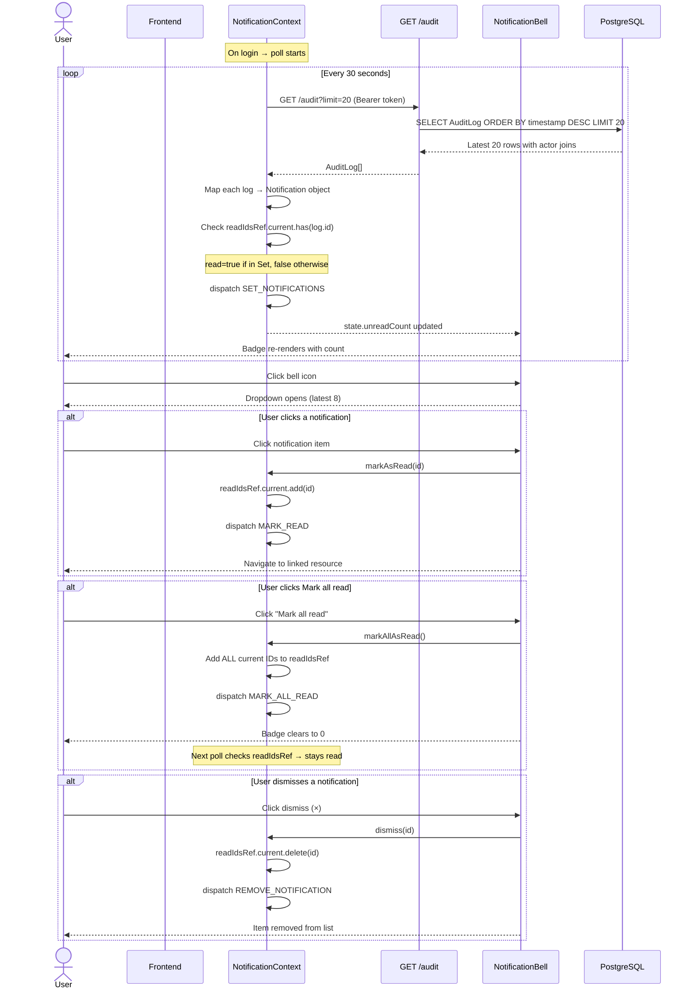
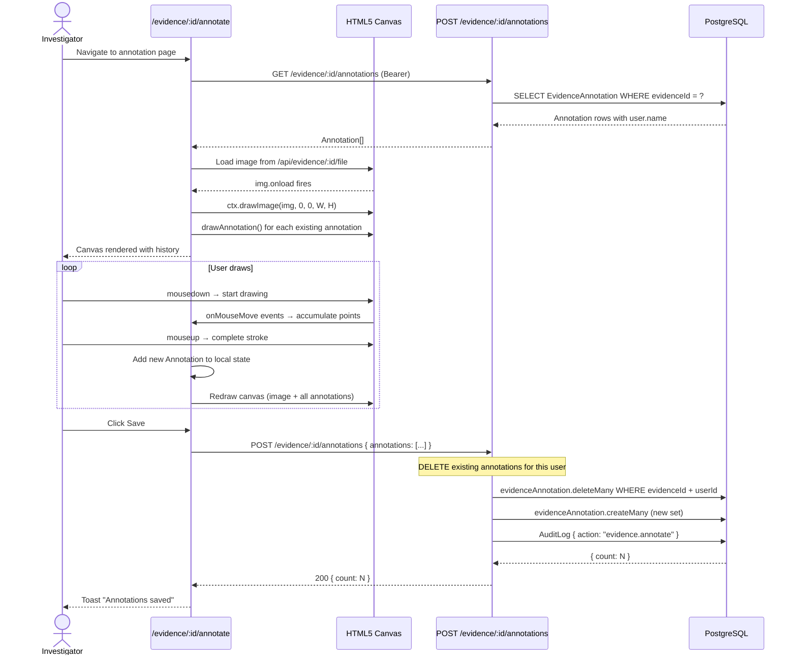
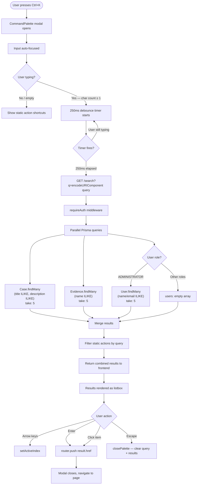
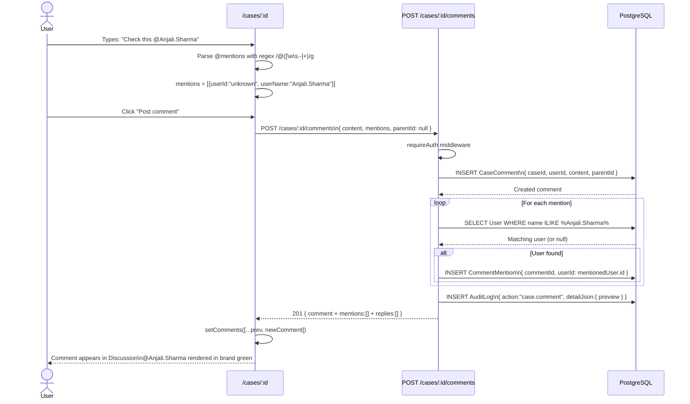
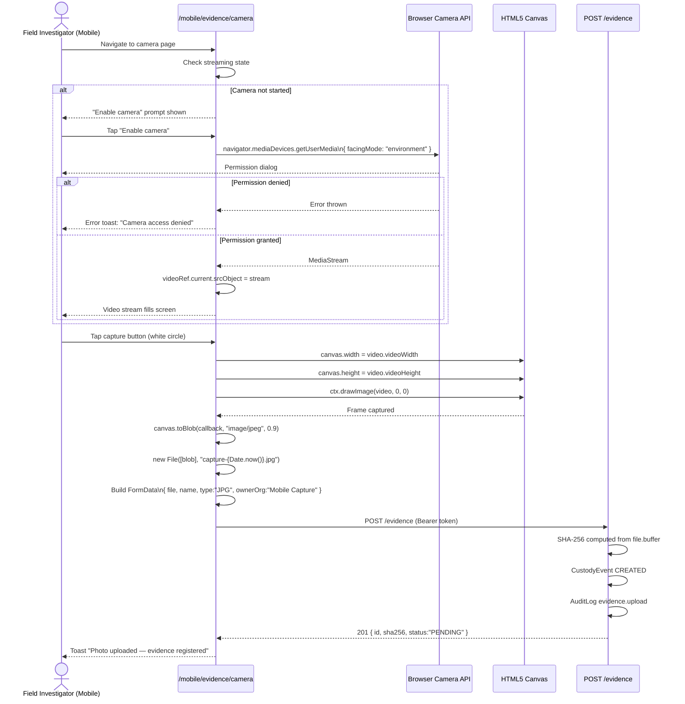
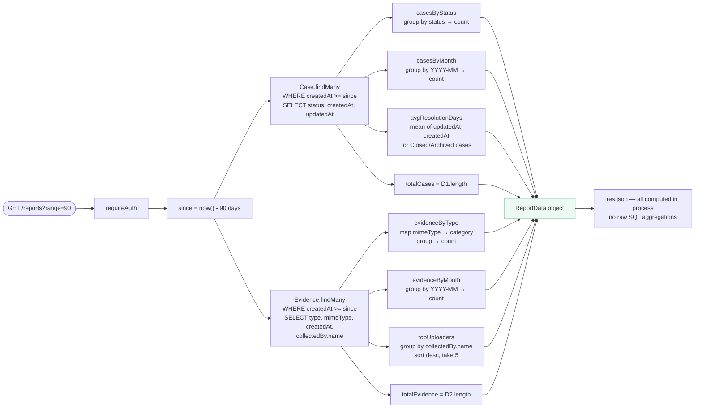
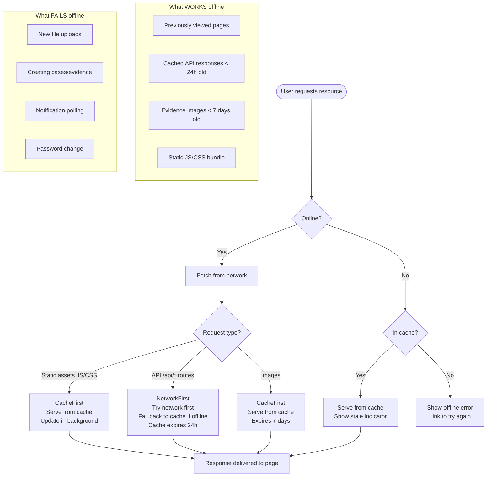
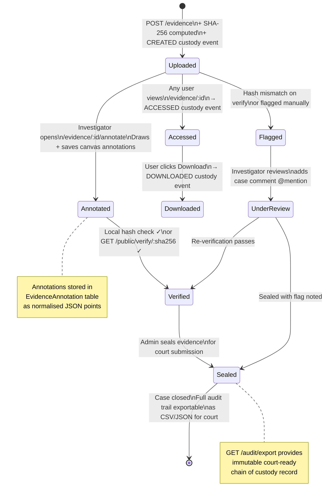

# EviChain — Advanced Feature Diagrams

All diagrams use Mermaid syntax. Render at https://mermaid.live or with the VSCode Mermaid Preview extension.

---

## Diagram 1 — Notification Flow (Complete)



---

## Diagram 2 — Annotation Save / Load Pipeline



---

## Diagram 3 — Global Search Architecture



---

## Diagram 4 — Audit Export Pipeline

```mermaid
flowchart TD
    A([User clicks Download]) --> B{Format selected?}

    B -->|JSON| C[POST /audit/export\nbody: format=json + filters]
    B -->|CSV| D[POST /audit/export\nbody: format=csv + filters]

    C --> E[requireRole ADMINISTRATOR, AUDITOR]
    D --> E

    E -->|403| F[Return Insufficient permissions]
    E -->|Pass| G[buildWhere from filters\nresourceType, resourceId,\nactorUserId, action, from, to]

    G --> H[prisma.auditLog.findMany\nno limit cap on export\ninclude: actor]

    H --> I{Format?}

    I -->|JSON| J[Wrap in metadata envelope\n{ product, exportedAt,\nexportedBy, totalRecords, logs }]
    I -->|CSV| K[toCsv helper\nEscape values, build rows\none row per log entry]

    J --> L[Set Content-Type: application/json\nContent-Disposition: attachment\nfilename: audit-export-DATE.json]
    K --> M[Set Content-Type: text/csv\nContent-Disposition: attachment\nfilename: audit-export-DATE.csv]

    L --> N[res.json payload]
    M --> O[res.send csv string]

    N --> P[Browser receives blob]
    O --> P

    P --> Q[window.URL.createObjectURL blob]
    Q --> R[anchor.click — file downloads]
    R --> S[window.URL.revokeObjectURL]
    S --> T[Toast: Download started: filename]
```

---

## Diagram 5 — Case Comment + @Mention Flow



---

## Diagram 6 — Mobile Camera Capture → Upload



---

## Diagram 7 — Reports Data Aggregation Pipeline



---

## Diagram 8 — Search Ranking & Result Grouping

```mermaid
flowchart TD
    A[Search query: q = 'midnight'] --> B[Backend: parallel queries]

    B --> C[Cases: title ILIKE '%midnight%'\nOR description ILIKE '%midnight%'\ntake: 5]
    B --> D[Evidence: name ILIKE '%midnight%'\ntake: 5]
    B --> E{Role = ADMINISTRATOR?}
    E -->|Yes| F[Users: name ILIKE '%midnight%'\nOR email ILIKE '%midnight%'\ntake: 5]
    E -->|No| G[users: empty array]

    C --> H[Map to SearchResult:\n{ id, type:'case', title, subtitle:status, href }]
    D --> I[Map to SearchResult:\n{ id, type:'evidence', title:name,\nsubtitle:case.title, href }]
    F --> J[Map to SearchResult:\n{ id, type:'user', title:name,\nsubtitle:email, href }]

    H & I & J --> K[Merge DB results]
    K --> L[Filter static STATIC_ACTIONS\nby query.toLowerCase includes]
    L --> M[Combine: DB results + matching actions]

    M --> N[Frontend renders:\n● Cases first\n● Evidence second\n● Users third\n● Actions last]

    style N fill:#eff6ff,stroke:#2563eb
```

---

## Diagram 9 — PWA Offline Strategy



---

## Diagram 10 — Evidence Lifecycle with Advanced Features


