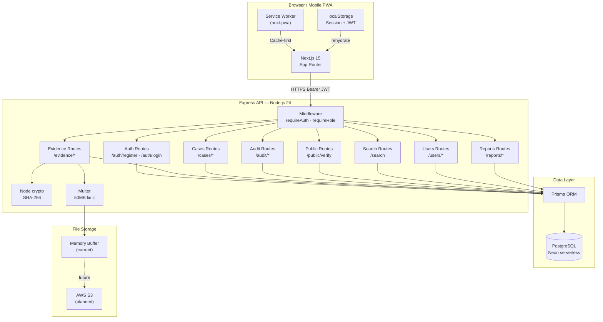
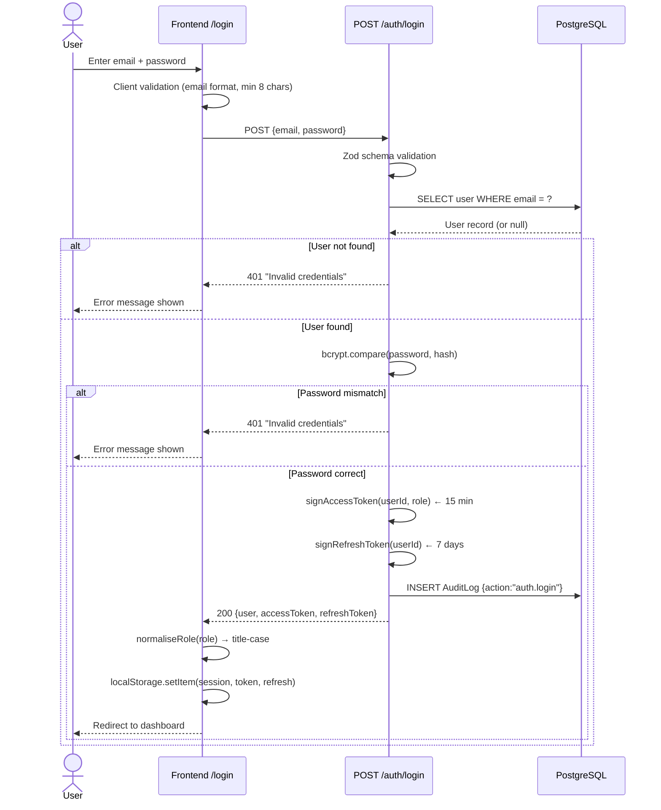
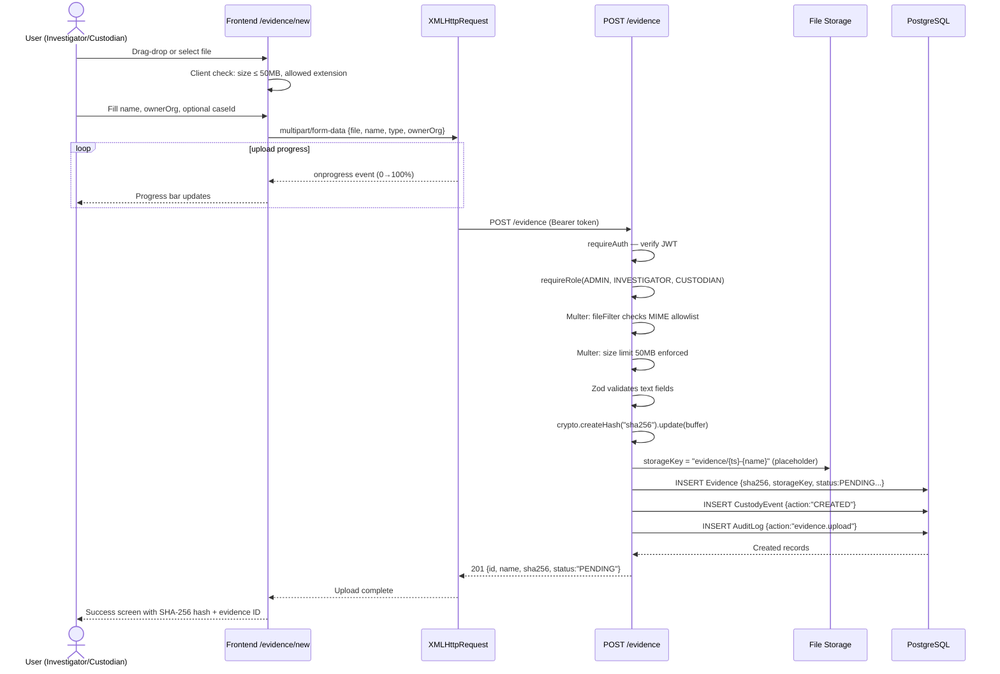
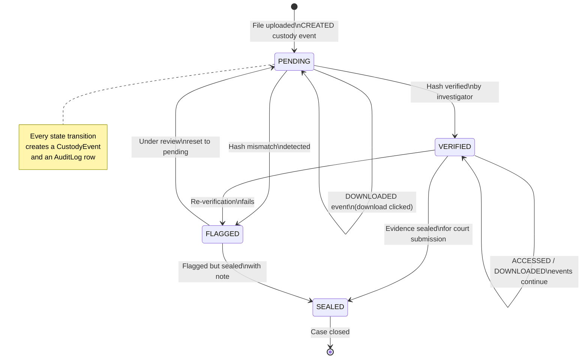
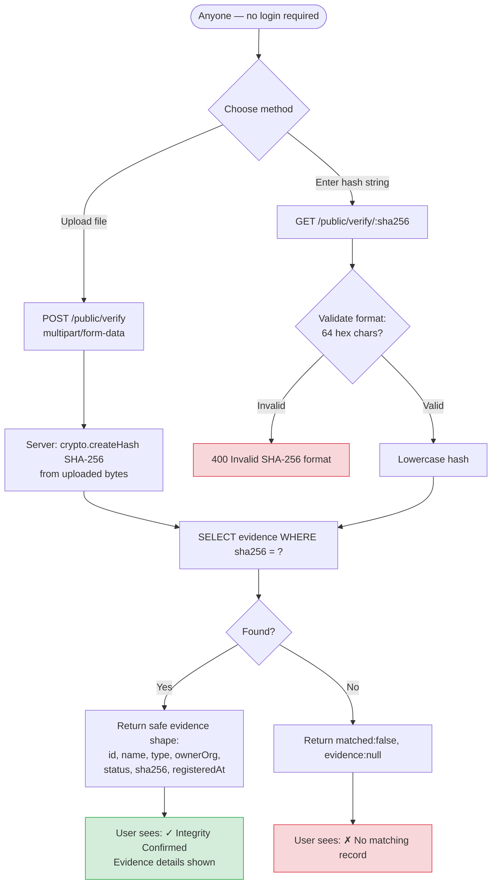
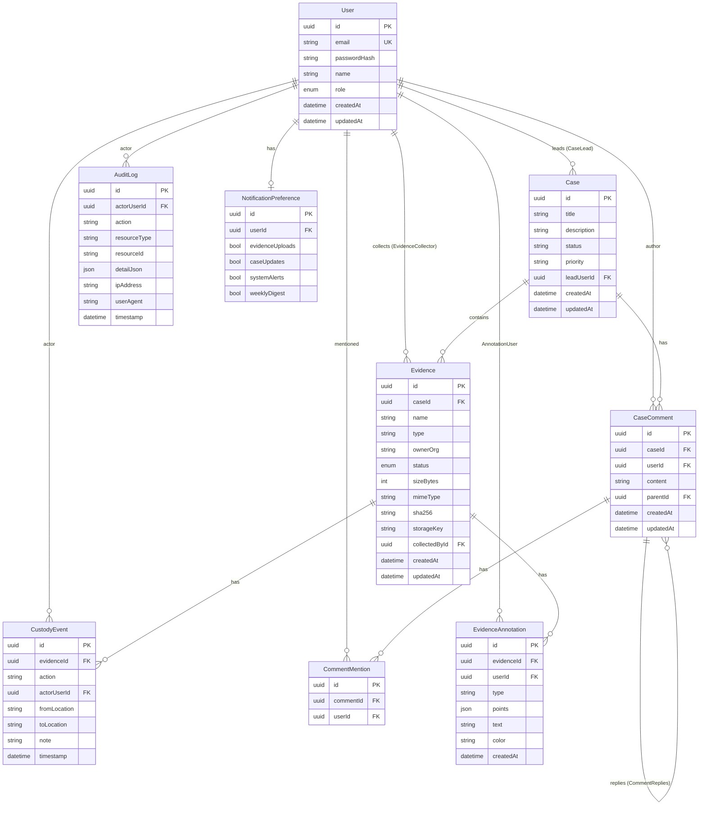
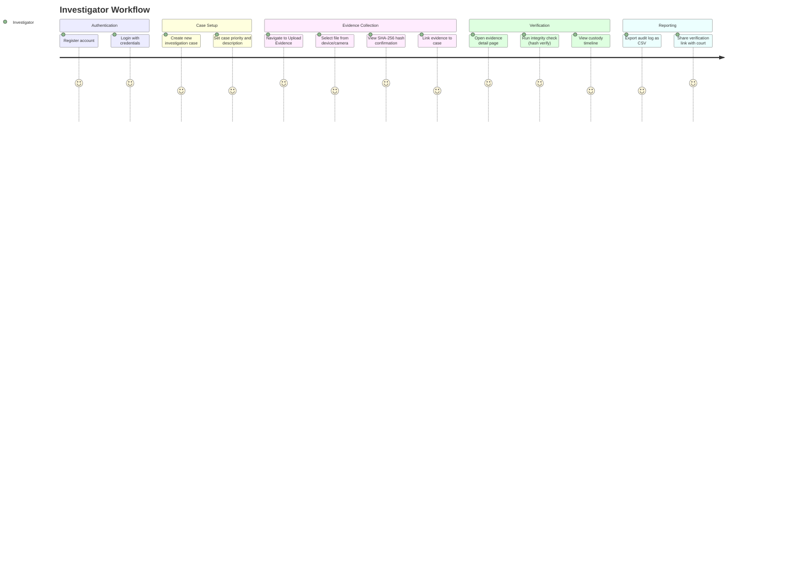
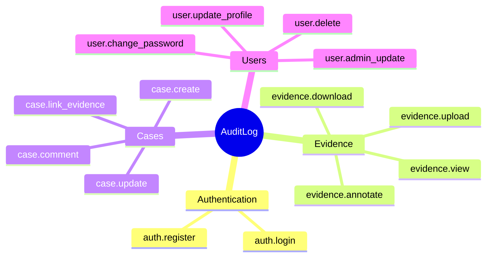
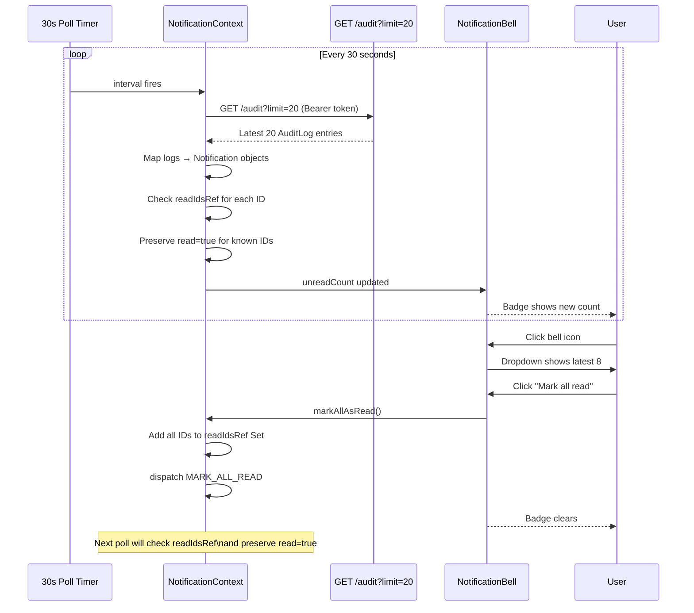

# EviChain — Architecture & Flow Diagrams

All diagrams use Mermaid syntax. Render in GitHub, VSCode (Mermaid Preview extension), or https://mermaid.live

---

## Diagram 1 — System Architecture



---

## Diagram 2 — Authentication Flow



---

## Diagram 3 — Evidence Upload & Fingerprinting Flow



---

## Diagram 4 — Chain of Custody Lifecycle



---

## Diagram 5 — Public Verification Flow



---

## Diagram 6 — Database Schema (Entity Relationship)



---

## Diagram 7 — Investigator User Journey



---

## Diagram 8 — Administrator Workflow

```mermaid
flowchart LR
    A([Admin Login]) --> B[View Dashboard\nStats + recent activity]
    B --> C{What task?}

    C -->|User management| D[/admin/users]
    D --> D1[View all users]
    D1 --> D2{Action}
    D2 -->|Edit role| D3[PATCH /users/:id]
    D2 -->|Delete| D4{Last admin?}
    D4 -->|Yes| D5[Blocked - 400]
    D4 -->|No| D6[User deleted + audit log]

    C -->|Evidence oversight| E[/evidence\nAll evidence across all cases]
    E --> E1[Filter by status/case]
    E1 --> E2[View detail + custody chain]

    C -->|Audit review| F[/audit]
    F --> F1[Filter by user/date/action]
    F1 --> F2[Export as CSV or JSON]

    C -->|Reports| G[/reports]
    G --> G1[View charts + aggregations]
    G1 --> G2[Export report CSV]

    C -->|Case management| H[/cases]
    H --> H1[Create/update/close cases]

    style D5 fill:#f8d7da,stroke:#dc3545
```

---

## Diagram 9 — Audit Log Generation Map



---

## Diagram 10 — Notification Flow


